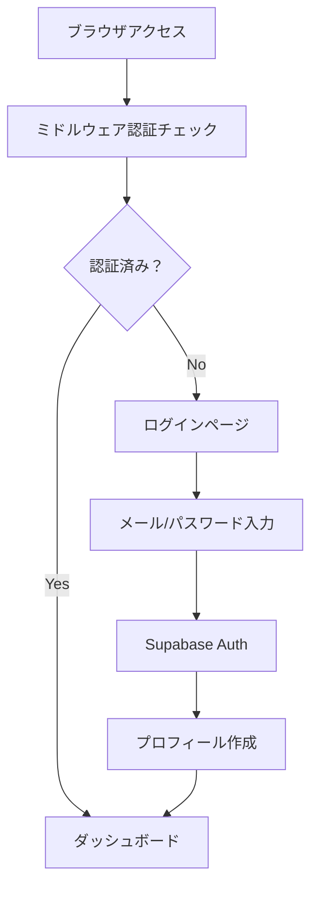
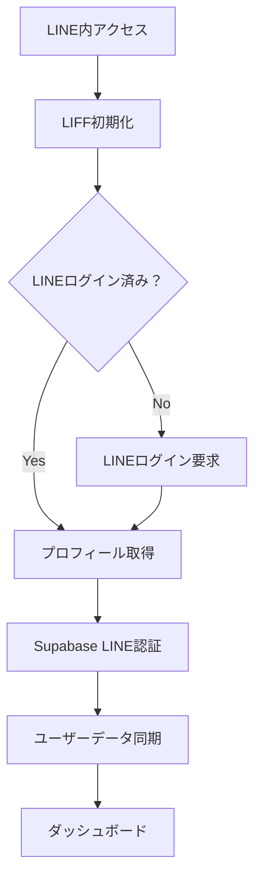

# MoneyFlow MVP - Supabase + LINE認証実装計画

## 🎯 MVP範囲

### 対応認証方式
- **ブラウザアクセス**: Supabase標準認証（メール/パスワード）
- **LINEアプリアクセス**: LINE LIFF認証

### 除外する機能（将来実装）
- Google OAuth
- GitHub OAuth  
- 複雑なアカウント連携

## 📋 必要な環境変数（MVP用）

### **必須設定**
```bash
# Supabase
NEXT_PUBLIC_SUPABASE_URL="https://your-project.supabase.co"
NEXT_PUBLIC_SUPABASE_ANON_KEY="your-anon-key"
SUPABASE_SERVICE_ROLE_KEY="your-service-key"

# LINE LIFF
NEXT_PUBLIC_LIFF_ID="123456789-abcdefgh"
LINE_CHANNEL_ACCESS_TOKEN="your-access-token"
LINE_CHANNEL_SECRET="your-channel-secret"

# 基本設定
NEXT_PUBLIC_APP_URL="http://localhost:3000"
```

### **開発用設定**
```bash
# LIFF開発用モック
NEXT_PUBLIC_LIFF_MOCK_ENABLED=true
NEXT_PUBLIC_TEST_LINE_USER_ID=test-user-123
NODE_ENV=development
```

## 🏗️ 実装フェーズ（MVP版）

### **Phase A: Supabase基盤（Week 1）**
- [x] Next.js + TypeScript基盤構築済み
- [ ] Supabaseプロジェクト作成
- [ ] 認証テーブル設計・作成
- [ ] RLS（Row Level Security）設定
- [ ] Supabaseクライアント設定

### **Phase B: ブラウザ認証（Week 2）**
- [ ] メール/パスワード認証実装
- [ ] 認証状態管理（useAuth hook）
- [ ] ログインページ作成
- [ ] 認証ミドルウェア実装
- [ ] プロフィール管理

### **Phase C: LINE認証（Week 3-4）**
- [ ] LIFF SDK統合
- [ ] LINE認証サービス実装
- [ ] アクセス判定ロジック
- [ ] 統合認証コンテキスト
- [ ] 開発環境用モック機能

### **Phase D: 統合・テスト（Week 5）**
- [ ] 認証フロー統合テスト
- [ ] エラーハンドリング
- [ ] セキュリティ監査
- [ ] UIポリッシュ

## 🛠️ 技術構成（MVP）

### **必要パッケージ**
```json
{
  "dependencies": {
    "@line/liff": "^2.x",
    "@supabase/ssr": "^0.x", 
    "@supabase/supabase-js": "^2.x"
  }
}
```

### **ディレクトリ構成**
```
app/
├── (auth)/
│   ├── login/page.tsx        # 統合ログインページ
│   └── callback/page.tsx     # 認証コールバック
├── middleware.ts             # 認証ミドルウェア

components/
├── auth/
│   ├── AuthProvider.tsx      # 統合認証コンテキスト
│   ├── AccessDetector.tsx    # アクセス方法判定
│   └── EmailLoginForm.tsx    # メール認証フォーム

lib/
├── auth/
│   ├── access-detector.ts    # アクセス判定ロジック
│   ├── mvp-auth-service.ts   # MVP認証サービス
│   └── liff-client.ts        # LIFFクライアント
├── supabase/
│   ├── client.ts
│   ├── server.ts
│   └── middleware.ts

hooks/
├── useAuth.ts                # 統合認証状態
└── useLiff.ts                # LIFF状態管理
```

## 🔐 セキュリティ設定（MVP）

### **Supabase設定**
```sql
-- ユーザーテーブル
CREATE TABLE users (
  id UUID REFERENCES auth.users(id) PRIMARY KEY,
  email TEXT,
  display_name TEXT NOT NULL,
  avatar_url TEXT,
  auth_provider TEXT CHECK (auth_provider IN ('email', 'line')),
  line_user_id TEXT UNIQUE,
  is_line_linked BOOLEAN DEFAULT false,
  created_at TIMESTAMPTZ DEFAULT NOW(),
  updated_at TIMESTAMPTZ DEFAULT NOW()
);

-- RLSポリシー
ALTER TABLE users ENABLE ROW LEVEL SECURITY;

CREATE POLICY "Users can view own profile" ON users
  FOR SELECT USING (auth.uid() = id);

CREATE POLICY "Users can update own profile" ON users  
  FOR UPDATE USING (auth.uid() = id);

CREATE POLICY "Users can insert own profile" ON users
  FOR INSERT WITH CHECK (auth.uid() = id);
```

## 🚀 デプロイ設定（MVP）

### **Vercel環境変数**
```bash
# 本番環境用
NEXT_PUBLIC_SUPABASE_URL=https://prod-project.supabase.co
NEXT_PUBLIC_SUPABASE_ANON_KEY=prod-anon-key
SUPABASE_SERVICE_ROLE_KEY=prod-service-key

NEXT_PUBLIC_LIFF_ID=prod-liff-id
LINE_CHANNEL_ACCESS_TOKEN=prod-access-token

NEXT_PUBLIC_APP_URL=https://moneyflow.vercel.app
NEXTAUTH_URL=https://moneyflow.vercel.app
NEXTAUTH_SECRET=random-secret-string

# LIFFモック無効化
NEXT_PUBLIC_LIFF_MOCK_ENABLED=false
```

## 📱 認証フロー（MVP）

### **ブラウザアクセス**


### **LINEアクセス**


## ✅ 実装チェックリスト

### **Phase A: Supabase基盤**
- [ ] Supabaseプロジェクト作成
- [ ] 認証設定（Email有効化）
- [ ] データベーススキーマ作成
- [ ] RLSポリシー設定
- [ ] 環境変数設定

### **Phase B: ブラウザ認証**
- [ ] Supabaseクライアント設定
- [ ] useAuth フック実装
- [ ] AuthProvider コンテキスト
- [ ] ログインページ作成
- [ ] 認証ミドルウェア

### **Phase C: LINE認証**
- [ ] LINE Developersアプリ作成
- [ ] LIFF設定
- [ ] LIFFクライアント実装
- [ ] LINE認証サービス
- [ ] アクセス判定ロジック

### **Phase D: 統合**
- [ ] 統合認証コンテキスト
- [ ] エラーハンドリング
- [ ] 認証フロー統合テスト
- [ ] セキュリティ確認

## 🎯 成功基準

1. **ブラウザユーザー**: メール/パスワードでログイン → ダッシュボード表示
2. **LINEユーザー**: LINEアプリ内でシームレス認証 → ダッシュボード表示
3. **データ分離**: 各ユーザーが自分のデータのみアクセス可能
4. **セッション管理**: 適切な認証状態の維持・期限管理

この計画でSupabase + LINE認証のMVPを効率的に実装できます！ 