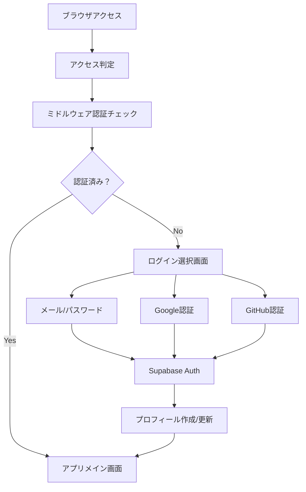
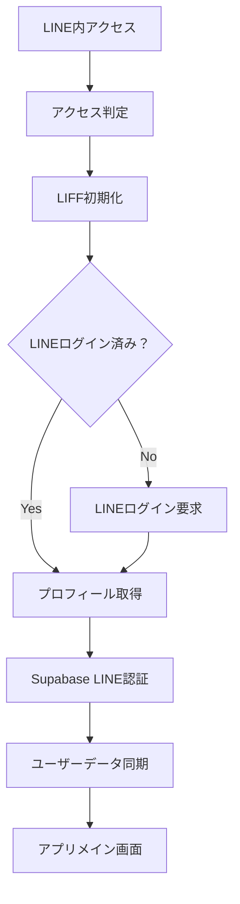

# MoneyFlow - 統合認証システム設計書

## 1. 概要・目標

### 1.1 実装目標
- **主目標**: ブラウザとLINEアプリの両方で動作する家計簿アプリ
- **副目標**: シームレスなユーザー体験と認証選択の自由度
- **将来目標**: LINEメッセンジャーからのテキスト・画像入力による自動家計簿登録

### 1.2 対応する認証パターン

#### パターンA: ブラウザアクセス（PC/スマホブラウザ）
- **メール/パスワード認証**（Supabase標準）
- **Google認証**（OAuth）
- **GitHub認証**（OAuth）※ 開発者向け

#### パターンB: LINEアプリアクセス
- **LINEログイン**（LIFF経由）
- **自動認証**（LINE内でのシームレス体験）

### 1.3 認証フロー要件
1. **LINE内アクセス**: シームレスな認証（ログインレス）
2. **ブラウザアクセス**: 複数認証方式から選択可能
3. **セッション統合**: Supabase Authとの連携
4. **データ連携**: 認証方式に関わらず同じユーザーデータにアクセス

## 2. ユーザーアカウント統合戦略

### 2.1 データベース設計

```typescript
// 統合ユーザー管理
interface User {
  id: UUID                        // Supabase auth.users.id
  email?: string                  // メール認証時のみ
  display_name: string            // 表示名
  avatar_url?: string             // プロフィール画像
  timezone: string                // タイムゾーン
  currency: string                // 通貨設定
  
  // 認証プロバイダー情報
  auth_provider: 'email' | 'google' | 'github' | 'line'
  line_user_id?: string           // LINE連携時のみ
  google_user_id?: string         // Google認証時のみ
  
  // アカウント連携フラグ
  is_line_linked: boolean         // LINE連携済みかどうか
  linked_at?: timestamp           // 連携日時
  
  // アプリ設定
  budget_reset_day: number        // 予算リセット日
  notification_enabled: boolean   // 通知設定
  
  created_at: timestamp
  updated_at: timestamp
}
```

### 2.2 DB更新SQL

```sql
-- users テーブルに認証プロバイダー情報を追加
ALTER TABLE users ADD COLUMN IF NOT EXISTS auth_provider TEXT CHECK (auth_provider IN ('email', 'google', 'github', 'line'));
ALTER TABLE users ADD COLUMN IF NOT EXISTS google_user_id TEXT UNIQUE;
ALTER TABLE users ADD COLUMN IF NOT EXISTS is_line_linked BOOLEAN DEFAULT false;
ALTER TABLE users ADD COLUMN IF NOT EXISTS linked_at TIMESTAMP WITH TIME ZONE;

-- インデックス追加
CREATE INDEX IF NOT EXISTS idx_users_auth_provider ON users(auth_provider);
CREATE INDEX IF NOT EXISTS idx_users_google_user_id ON users(google_user_id) WHERE google_user_id IS NOT NULL;
```

## 3. 技術構成

### 3.1 使用技術スタック

```typescript
// 認証関連
"@line/liff": "^2.x",           // LIFF SDK
"@supabase/ssr": "^0.x",        // Supabase SSR
"@supabase/supabase-js": "^2.x" // Supabase Client

// Next.js関連
"next": "15.x",                 // App Router
"@types/node": "^20.x"          // TypeScript Support

// UI関連
"@radix-ui/react-*": "^1.x",    // shadcn/ui components
"tailwindcss": "^3.x"           // Styling
```

### 3.2 環境変数設定

```bash
# .env.local
NEXT_PUBLIC_SUPABASE_URL=your-supabase-url
NEXT_PUBLIC_SUPABASE_ANON_KEY=your-anon-key
SUPABASE_SERVICE_ROLE_KEY=your-service-key

# LIFF設定（LINEアクセス用）
NEXT_PUBLIC_LIFF_ID=123456789-abcdefgh

# OAuth設定
NEXT_PUBLIC_GOOGLE_CLIENT_ID=your-google-client-id
NEXT_PUBLIC_GITHUB_CLIENT_ID=your-github-client-id

# 開発環境用
NEXT_PUBLIC_LIFF_MOCK_ENABLED=true
NEXT_PUBLIC_TEST_LINE_USER_ID=test-user-123
```

## 4. アーキテクチャ設計

### 4.1 認証フロー分岐

#### ブラウザアクセス時の認証フロー


#### LINEアクセス時の認証フロー


### 4.2 ディレクトリ構成

```
app/
├── (auth)/
│   ├── login/
│   │   └── page.tsx              # 統合ログインページ
│   ├── callback/
│   │   └── page.tsx              # OAuth callback処理
│   └── signup/
│       └── page.tsx              # 新規登録ページ
├── middleware.ts                 # 認証ミドルウェア
├── globals.css
└── layout.tsx

components/
├── auth/
│   ├── AuthProvider.tsx          # 統合認証コンテキスト
│   ├── AccessDetector.tsx        # アクセス方法判定
│   ├── EmailPasswordForm.tsx     # メール認証フォーム
│   └── SocialLoginButtons.tsx    # ソーシャル認証ボタン群
└── layout/
    └── AuthGuard.tsx             # 認証ガード

lib/
├── auth/
│   ├── access-detector.ts        # アクセス方法判定ロジック
│   ├── hybrid-auth-service.ts    # 統合認証サービス
│   ├── liff-client.ts            # LIFFクライアント
│   └── auth-utils.ts             # 認証ユーティリティ
├── supabase/
│   ├── client.ts                 # クライアント用
│   ├── server.ts                 # サーバー用
│   └── middleware.ts             # ミドルウェア用
└── types/
    └── auth.ts                   # 認証関連型定義

hooks/
├── useAuth.ts                    # 統合認証状態管理
├── useLiff.ts                    # LIFF状態管理
└── useProfile.ts                 # ユーザープロファイル管理
```

## 5. 実装詳細

### 5.1 アクセス判定ロジック

```typescript
// lib/auth/access-detector.ts
export class AccessDetector {
  static detectAccessMethod(): 'browser' | 'line' {
    if (typeof window === 'undefined') return 'browser'
    
    const userAgent = window.navigator.userAgent
    
    // LINEアプリ内ブラウザの判定
    if (userAgent.includes('Line/')) {
      return 'line'
    }
    
    // LIFFの環境チェック
    if (process.env.NEXT_PUBLIC_LIFF_ID && 
        window.location.hostname.includes('liff')) {
      return 'line'
    }
    
    return 'browser'
  }
  
  static isLiffEnvironment(): boolean {
    return this.detectAccessMethod() === 'line'
  }
  
  static isMobileDevice(): boolean {
    if (typeof window === 'undefined') return false
    return /Android|webOS|iPhone|iPad|iPod|BlackBerry|IEMobile|Opera Mini/i.test(
      window.navigator.userAgent
    )
  }
}
```

### 5.2 LIFF初期化処理

```typescript
// lib/auth/liff-client.ts
import liff from '@line/liff'

export class LiffClient {
  private static instance: LiffClient
  private isInitialized = false

  static getInstance(): LiffClient {
    if (!LiffClient.instance) {
      LiffClient.instance = new LiffClient()
    }
    return LiffClient.instance
  }

  async initialize(): Promise<void> {
    if (this.isInitialized) return

    const liffId = process.env.NEXT_PUBLIC_LIFF_ID
    if (!liffId) throw new Error('LIFF_ID is required')

    // 開発環境でのモック設定
    if (process.env.NEXT_PUBLIC_LIFF_MOCK_ENABLED === 'true') {
      await this.initializeMock(liffId)
    } else {
      await liff.init({ liffId })
    }

    this.isInitialized = true
  }

  private async initializeMock(liffId: string): Promise<void> {
    const { LiffMockPlugin } = await import('@line/liff/mock')
    liff.use(new LiffMockPlugin())
    
    await liff.init({
      liffId,
      mock: true,
    })

    // モックプロファイル設定
    liff.$mock.set({
      isInClient: true,
      getProfile: () => ({
        userId: process.env.NEXT_PUBLIC_TEST_LINE_USER_ID || 'test-user',
        displayName: 'テストユーザー',
        pictureUrl: undefined,
        statusMessage: undefined,
      }),
    })
  }

  async getProfile() {
    if (!this.isInitialized) {
      await this.initialize()
    }
    return await liff.getProfile()
  }

  isLoggedIn(): boolean {
    return liff.isLoggedIn()
  }

  async login(): Promise<void> {
    if (!liff.isLoggedIn()) {
      liff.login()
    }
  }

  getAccessToken(): string {
    return liff.getAccessToken()
  }
}

export const liffClient = LiffClient.getInstance()
```

### 5.3 統合認証サービス

```typescript
// lib/auth/hybrid-auth-service.ts
import { createClient } from '@/lib/supabase/client'
import { liffClient } from './liff-client'
import { AccessDetector } from './access-detector'

export interface LineProfile {
  userId: string
  displayName: string
  pictureUrl?: string
  statusMessage?: string
}

export class HybridAuthService {
  private supabase = createClient()

  // メール/パスワード認証
  async signInWithEmail(email: string, password: string) {
    const { data, error } = await this.supabase.auth.signInWithPassword({
      email,
      password,
    })

    if (error) throw error

    // プロフィール同期
    await this.syncUserProfile({
      auth_provider: 'email',
      email,
      display_name: email.split('@')[0],
    })

    return data
  }

  // メール/パスワード新規登録
  async signUpWithEmail(email: string, password: string) {
    const { data, error } = await this.supabase.auth.signUp({
      email,
      password,
      options: {
        data: {
          display_name: email.split('@')[0],
        }
      }
    })

    if (error) throw error
    return data
  }

  // Google認証
  async signInWithGoogle() {
    const { data, error } = await this.supabase.auth.signInWithOAuth({
      provider: 'google',
      options: {
        redirectTo: `${window.location.origin}/auth/callback`,
        queryParams: {
          access_type: 'offline',
          prompt: 'consent',
        }
      }
    })

    if (error) throw error
    return data
  }

  // GitHub認証
  async signInWithGithub() {
    const { data, error } = await this.supabase.auth.signInWithOAuth({
      provider: 'github',
      options: {
        redirectTo: `${window.location.origin}/auth/callback`,
      }
    })

    if (error) throw error
    return data
  }

  // LINE認証（LIFF経由）
  async signInWithLine() {
    if (!AccessDetector.isLiffEnvironment()) {
      throw new Error('LINE login is only available in LINE app')
    }

    // LIFF初期化
    await liffClient.initialize()
    
    if (!liffClient.isLoggedIn()) {
      await liffClient.login()
      return
    }

    // LINEプロフィール取得
    const profile = await liffClient.getProfile()
    const accessToken = liffClient.getAccessToken()

    // Supabaseカスタム認証
    const { data, error } = await this.supabase.auth.signInWithIdToken({
      provider: 'line',
      token: accessToken,
      options: {
        userAttributes: {
          line_user_id: profile.userId,
          display_name: profile.displayName,
          avatar_url: profile.pictureUrl,
        },
      },
    })

    if (error) throw error

    // プロフィール同期
    await this.syncUserProfile({
      auth_provider: 'line',
      line_user_id: profile.userId,
      display_name: profile.displayName,
      avatar_url: profile.pictureUrl,
      is_line_linked: true,
    })

    return data
  }

  // ユーザープロフィール同期
  private async syncUserProfile(profileData: {
    auth_provider: 'email' | 'google' | 'github' | 'line'
    email?: string
    line_user_id?: string
    google_user_id?: string
    display_name: string
    avatar_url?: string
    is_line_linked?: boolean
  }) {
    const { data: { user } } = await this.supabase.auth.getUser()
    if (!user) return

    const updateData = {
      id: user.id,
      email: profileData.email || user.email,
      display_name: profileData.display_name,
      avatar_url: profileData.avatar_url || user.user_metadata?.avatar_url,
      auth_provider: profileData.auth_provider,
      line_user_id: profileData.line_user_id,
      google_user_id: profileData.google_user_id,
      is_line_linked: profileData.is_line_linked || false,
      updated_at: new Date().toISOString(),
    }

    const { error } = await this.supabase
      .from('users')
      .upsert(updateData, {
        onConflict: 'id',
      })

    if (error) {
      console.error('Failed to sync user profile:', error)
    }
  }

  // ログアウト
  async signOut() {
    await this.supabase.auth.signOut()
  }
}

export const hybridAuthService = new HybridAuthService()
```

### 5.4 統合認証コンテキスト

```typescript
// components/auth/AuthProvider.tsx
'use client'
import { createContext, useContext, useEffect, useState } from 'react'
import { User, Session } from '@supabase/supabase-js'
import { createClient } from '@/lib/supabase/client'
import { hybridAuthService, LineProfile } from '@/lib/auth/hybrid-auth-service'
import { AccessDetector } from '@/lib/auth/access-detector'

interface AuthContextType {
  user: User | null
  session: Session | null
  lineProfile: LineProfile | null
  isLoading: boolean
  accessMethod: 'browser' | 'line'
  
  // 認証メソッド
  signInWithEmail: (email: string, password: string) => Promise<void>
  signUpWithEmail: (email: string, password: string) => Promise<void>
  signInWithGoogle: () => Promise<void>
  signInWithGithub: () => Promise<void>
  signInWithLine: () => Promise<void>
  signOut: () => Promise<void>
}

const AuthContext = createContext<AuthContextType | undefined>(undefined)

export function AuthProvider({ children }: { children: React.ReactNode }) {
  const [user, setUser] = useState<User | null>(null)
  const [session, setSession] = useState<Session | null>(null)
  const [lineProfile, setLineProfile] = useState<LineProfile | null>(null)
  const [isLoading, setIsLoading] = useState(true)
  const [accessMethod, setAccessMethod] = useState<'browser' | 'line'>('browser')
  
  const supabase = createClient()

  useEffect(() => {
    // アクセス方法の判定
    const method = AccessDetector.detectAccessMethod()
    setAccessMethod(method)

    // 認証状態の初期化
    const initializeAuth = async () => {
      try {
        const { data: { session } } = await supabase.auth.getSession()
        setSession(session)
        setUser(session?.user ?? null)

        // LINEプロファイル復元
        if (session?.user && method === 'line') {
          const storedProfile = localStorage.getItem('line_profile')
          if (storedProfile) {
            setLineProfile(JSON.parse(storedProfile))
          }
        }
      } catch (error) {
        console.error('Auth initialization error:', error)
      } finally {
        setIsLoading(false)
      }
    }

    initializeAuth()

    // 認証状態変更の監視
    const { data: { subscription } } = supabase.auth.onAuthStateChange(
      async (event, session) => {
        setSession(session)
        setUser(session?.user ?? null)
        
        if (event === 'SIGNED_OUT') {
          setLineProfile(null)
          localStorage.removeItem('line_profile')
        }
        
        setIsLoading(false)
      }
    )

    return () => subscription.unsubscribe()
  }, [supabase])

  // 認証メソッド群
  const signInWithEmail = async (email: string, password: string) => {
    setIsLoading(true)
    try {
      await hybridAuthService.signInWithEmail(email, password)
    } finally {
      setIsLoading(false)
    }
  }

  const signUpWithEmail = async (email: string, password: string) => {
    setIsLoading(true)
    try {
      await hybridAuthService.signUpWithEmail(email, password)
    } finally {
      setIsLoading(false)
    }
  }

  const signInWithGoogle = async () => {
    await hybridAuthService.signInWithGoogle()
  }

  const signInWithGithub = async () => {
    await hybridAuthService.signInWithGithub()
  }

  const signInWithLine = async () => {
    setIsLoading(true)
    try {
      const result = await hybridAuthService.signInWithLine()
      
      // LINEプロファイルをローカルストレージに保存
      if (result && accessMethod === 'line') {
        const profile = await liffClient.getProfile()
        setLineProfile(profile)
        localStorage.setItem('line_profile', JSON.stringify(profile))
      }
    } finally {
      setIsLoading(false)
    }
  }

  const signOut = async () => {
    setIsLoading(true)
    try {
      await hybridAuthService.signOut()
    } finally {
      setIsLoading(false)
    }
  }

  return (
    <AuthContext.Provider
      value={{
        user,
        session,
        lineProfile,
        isLoading,
        accessMethod,
        signInWithEmail,
        signUpWithEmail,
        signInWithGoogle,
        signInWithGithub,
        signInWithLine,
        signOut,
      }}
    >
      {children}
    </AuthContext.Provider>
  )
}

export function useAuth() {
  const context = useContext(AuthContext)
  if (context === undefined) {
    throw new Error('useAuth must be used within an AuthProvider')
  }
  return context
}
```

### 5.5 統合ログインページ

```typescript
// app/(auth)/login/page.tsx
'use client'
import { useState, useEffect } from 'react'
import { useRouter, useSearchParams } from 'next/navigation'
import { Button } from '@/components/ui/button'
import { Card, CardContent, CardHeader, CardTitle } from '@/components/ui/card'
import { Separator } from '@/components/ui/separator'
import { Input } from '@/components/ui/input'
import { Label } from '@/components/ui/label'
import { Mail, Chrome, Github, Loader2 } from 'lucide-react'
import { AccessDetector } from '@/lib/auth/access-detector'
import { useAuth } from '@/components/auth/AuthProvider'

export default function LoginPage() {
  const { 
    signInWithEmail, 
    signUpWithEmail,
    signInWithGoogle, 
    signInWithGithub, 
    signInWithLine,
    user,
    isLoading,
    accessMethod 
  } = useAuth()
  
  const router = useRouter()
  const searchParams = useSearchParams()
  const redirectTo = searchParams.get('redirectTo') || '/dashboard'

  const [email, setEmail] = useState('')
  const [password, setPassword] = useState('')
  const [isSignUp, setIsSignUp] = useState(false)
  const [isSubmitting, setIsSubmitting] = useState(false)

  useEffect(() => {
    // 認証済みユーザーのリダイレクト
    if (user && !isLoading) {
      router.push(redirectTo)
    }
  }, [user, isLoading, router, redirectTo])

  useEffect(() => {
    // LINEアクセスの場合は自動的にLINEログインを実行
    if (accessMethod === 'line' && !user) {
      signInWithLine()
    }
  }, [accessMethod, signInWithLine, user])

  // LINEアクセスの場合はローディング画面
  if (accessMethod === 'line') {
    return (
      <div className="min-h-screen flex items-center justify-center">
        <Card className="w-full max-w-md">
          <CardContent className="pt-6">
            <div className="text-center">
              <Loader2 className="h-12 w-12 animate-spin text-green-500 mx-auto mb-4" />
              <p className="text-lg font-medium">LINEで認証中...</p>
              <p className="text-sm text-muted-foreground mt-2">
                しばらくお待ちください
              </p>
            </div>
          </CardContent>
        </Card>
      </div>
    )
  }

  // メール認証フォーム処理
  const handleEmailSubmit = async (e: React.FormEvent) => {
    e.preventDefault()
    if (!email || !password) return

    setIsSubmitting(true)
    try {
      if (isSignUp) {
        await signUpWithEmail(email, password)
      } else {
        await signInWithEmail(email, password)
      }
    } catch (error) {
      console.error('Auth error:', error)
      // エラートースト表示
    } finally {
      setIsSubmitting(false)
    }
  }

  // ブラウザアクセスの場合は認証選択画面
  return (
    <div className="min-h-screen flex items-center justify-center bg-gradient-to-br from-green-50 to-blue-50">
      <Card className="w-full max-w-md">
        <CardHeader className="text-center">
          <CardTitle className="text-2xl font-bold text-green-700">
            💰 MoneyFlow
          </CardTitle>
          <p className="text-muted-foreground">
            {isSignUp ? 'アカウントを作成' : 'アカウントにログイン'}してください
          </p>
        </CardHeader>
        <CardContent className="space-y-4">
          {/* メール認証フォーム */}
          <form onSubmit={handleEmailSubmit} className="space-y-3">
            <div>
              <Label htmlFor="email">メールアドレス</Label>
              <Input
                id="email"
                type="email"
                placeholder="your@example.com"
                value={email}
                onChange={(e) => setEmail(e.target.value)}
                required
              />
            </div>
            <div>
              <Label htmlFor="password">パスワード</Label>
              <Input
                id="password"
                type="password"
                placeholder="パスワードを入力"
                value={password}
                onChange={(e) => setPassword(e.target.value)}
                required
              />
            </div>
            <Button 
              type="submit" 
              className="w-full" 
              disabled={isSubmitting || isLoading}
            >
              {isSubmitting ? (
                <Loader2 className="mr-2 h-4 w-4 animate-spin" />
              ) : (
                <Mail className="mr-2 h-4 w-4" />
              )}
              {isSignUp ? 'アカウント作成' : 'ログイン'}
            </Button>
          </form>
          
          <Button
            type="button"
            variant="ghost"
            className="w-full text-sm"
            onClick={() => setIsSignUp(!isSignUp)}
          >
            {isSignUp ? 'すでにアカウントをお持ちですか？' : 'アカウントを作成'}
          </Button>
          
          <Separator className="my-4" />
          
          {/* ソーシャル認証 */}
          <div className="space-y-2">
            <Button
              onClick={signInWithGoogle}
              variant="outline"
              className="w-full"
              size="lg"
              disabled={isLoading}
            >
              <Chrome className="mr-2 h-4 w-4" />
              Googleでログイン
            </Button>
            
            <Button
              onClick={signInWithGithub}
              variant="outline"
              className="w-full"
              size="lg"
              disabled={isLoading}
            >
              <Github className="mr-2 h-4 w-4" />
              GitHubでログイン
            </Button>
          </div>
          
          <div className="text-center pt-4">
            <p className="text-sm text-muted-foreground">
              LINEアプリから開くとLINEログインができます
            </p>
          </div>
        </CardContent>
      </Card>
    </div>
  )
}
```

### 5.6 認証ミドルウェア

```typescript
// app/middleware.ts
import { createServerClient } from '@supabase/ssr'
import { NextResponse, type NextRequest } from 'next/server'

export async function middleware(request: NextRequest) {
  let response = NextResponse.next({
    request: {
      headers: request.headers,
    },
  })

  const supabase = createServerClient(
    process.env.NEXT_PUBLIC_SUPABASE_URL!,
    process.env.NEXT_PUBLIC_SUPABASE_ANON_KEY!,
    {
      cookies: {
        get(name: string) {
          return request.cookies.get(name)?.value
        },
        set(name: string, value: string, options: any) {
          request.cookies.set({ name, value, ...options })
          response = NextResponse.next({
            request: {
              headers: request.headers,
            },
          })
          response.cookies.set({ name, value, ...options })
        },
        remove(name: string, options: any) {
          request.cookies.set({ name, value: '', ...options })
          response = NextResponse.next({
            request: {
              headers: request.headers,
            },
          })
          response.cookies.set({ name, value: '', ...options })
        },
      },
    }
  )

  // 認証状態確認
  const { data: { user } } = await supabase.auth.getUser()

  // 保護されたルートの定義
  const protectedPaths = ['/dashboard', '/expenses', '/income', '/reports', '/categories', '/settings']
  const authPaths = ['/login', '/signup', '/auth/callback']
  
  const isProtectedPath = protectedPaths.some(path => 
    request.nextUrl.pathname.startsWith(path)
  )
  const isAuthPath = authPaths.some(path => 
    request.nextUrl.pathname.startsWith(path)
  )

  // 未認証ユーザーの保護されたページアクセス
  if (!user && isProtectedPath) {
    const redirectUrl = new URL('/login', request.url)
    redirectUrl.searchParams.set('redirectTo', request.nextUrl.pathname)
    return NextResponse.redirect(redirectUrl)
  }

  // 認証済みユーザーの認証ページアクセス
  if (user && isAuthPath && !request.nextUrl.pathname.startsWith('/auth/callback')) {
    const redirectTo = request.nextUrl.searchParams.get('redirectTo') || '/dashboard'
    return NextResponse.redirect(new URL(redirectTo, request.url))
  }

  return response
}

export const config = {
  matcher: [
    '/((?!_next/static|_next/image|favicon.ico|.*\\.(?:svg|png|jpg|jpeg|gif|webp)$).*)',
  ],
}
```

## 6. Supabase設定

### 6.1 認証プロバイダー設定

```bash
# Supabase Dashboard > Authentication > Providers で設定

# Email (デフォルトで有効)
Enable email confirmations: true
Enable email change confirmations: true

# Google OAuth
GOOGLE_CLIENT_ID=your-google-client-id
GOOGLE_CLIENT_SECRET=your-google-client-secret

# GitHub OAuth  
GITHUB_CLIENT_ID=your-github-client-id
GITHUB_CLIENT_SECRET=your-github-client-secret

# LINE (カスタムプロバイダー - JWT設定)
JWT_SECRET=your-jwt-secret
```

### 6.2 セキュリティ設定

```sql
-- RLS ポリシーの更新（認証プロバイダー対応）
DROP POLICY IF EXISTS "Users can view own profile" ON users;
CREATE POLICY "Users can view own profile"
  ON users FOR SELECT
  USING (auth.uid() = id);

DROP POLICY IF EXISTS "Users can update own profile" ON users;
CREATE POLICY "Users can update own profile"
  ON users FOR UPDATE
  USING (auth.uid() = id);

DROP POLICY IF EXISTS "Users can insert own profile" ON users;
CREATE POLICY "Users can insert own profile"
  ON users FOR INSERT
  WITH CHECK (auth.uid() = id);
```

## 7. 実装フェーズ

### Phase 1: 基盤実装（Week 1-2）
- [ ] DB設計更新（認証プロバイダー対応）
- [ ] Supabaseプロジェクト設定
- [ ] 基本認証サービス実装
- [ ] アクセス判定ロジック実装

### Phase 2: ブラウザ認証実装（Week 3-4）
- [ ] メール/パスワード認証
- [ ] Google OAuth設定・実装
- [ ] GitHub OAuth設定・実装
- [ ] 統合ログインページ作成

### Phase 3: LINE認証実装（Week 5-6）
- [ ] LIFF設定・初期化
- [ ] LINE認証サービス実装
- [ ] LIFF Mock環境構築
- [ ] 認証フロー統合

### Phase 4: 統合・最適化（Week 7-8）
- [ ] 認証コンテキスト統合
- [ ] ミドルウェア実装
- [ ] エラーハンドリング
- [ ] E2Eテスト実装

## 8. 利用シナリオ

### 8.1 ブラウザユーザー
1. PC/スマホブラウザでアクセス
2. メール/Google/GitHub認証から選択
3. 通常のWebアプリとして利用
4. デバイス間でのデータ同期

### 8.2 LINEユーザー
1. LINEアプリ内でアクセス
2. 自動的にLINEログイン実行
3. シームレスにアプリ利用開始
4. LINE特有の機能活用

### 8.3 ハイブリッドユーザー
将来的にアカウント連携機能を追加：
- ブラウザアカウントにLINE連携
- LINEアカウントにメール認証追加
- データの統合・移行
- シングルサインオン体験

## 9. セキュリティ・パフォーマンス考慮事項

### 9.1 セキュリティ
- **RLS設定**: 全テーブルでの適切なRow Level Security
- **トークン管理**: JWTとLIFFトークンの適切な管理
- **HTTPS必須**: 本番環境でのセキュア通信
- **認証状態検証**: サーバーサイドでの認証状態確認

### 9.2 パフォーマンス
- **認証キャッシュ**: セッション情報の適切なキャッシュ
- **遅延ロード**: 認証プロバイダー別のコード分割
- **初期化最適化**: LIFF初期化の効率化
- **エラー処理**: 適切なフォールバック処理